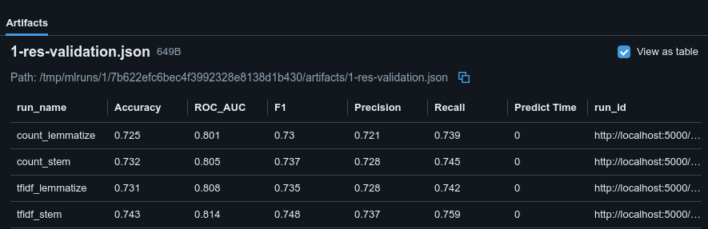
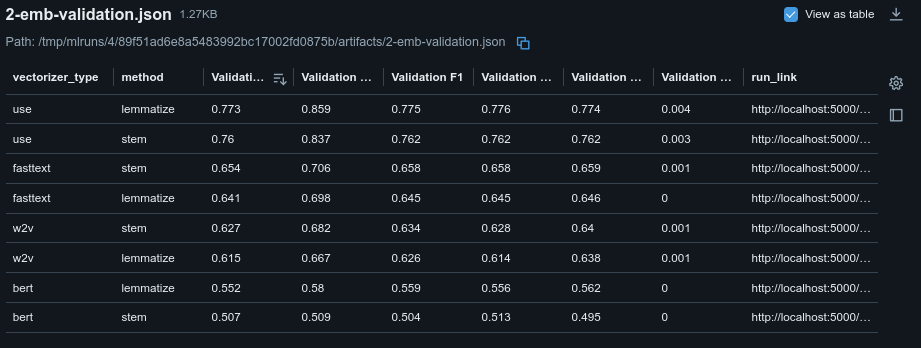
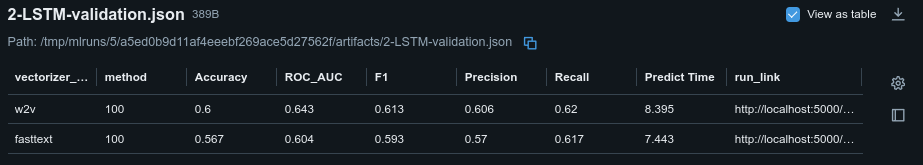
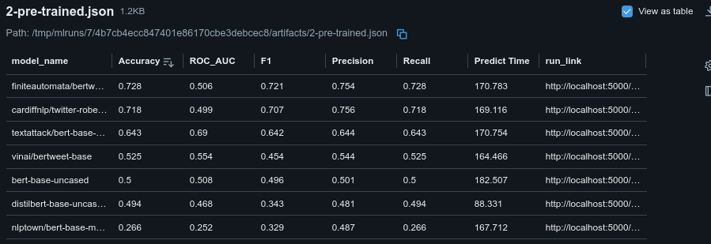
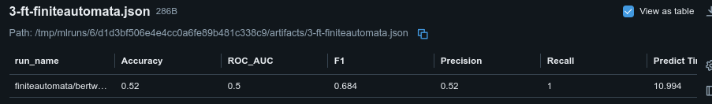
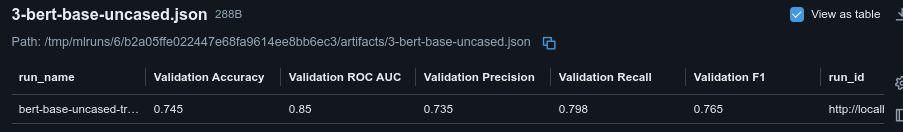

# 🌟 **Anticiper les Bad Buzz grâce à l’Analyse de Sentiments avec Deep Learning** 🌟

Dans un monde où la réputation en ligne est cruciale, les entreprises doivent anticiper les bad buzz sur les réseaux sociaux.
Ce projet, réalisé pour la compagnie aérienne _Air Paradis_, vise à développer un prototype d’intelligence artificielle capable de prédire
les sentiments associés à des tweets. Découvrez comment les approches classiques et avancées du Deep Learning, combinées aux principes
du MLOps, ont permis de relever ce défi ambitieux. 🚀

---

## **📖 Contexte et Objectif**

_Air Paradis_, confrontée à des critiques régulières sur les réseaux sociaux, a sollicité une solution capable de détecter rapidement
les tweets négatifs. L’objectif était de concevoir un modèle d’analyse de sentiments prédisant si un tweet est **positif** ou **négatif**,
à partir de données publiques issues de Twitter.

### Les Données 📊

- **Dataset utilisé** : Sentiment140 contenant 1,6 million de tweets, répartis en deux classes : négative (0) et positive (4).
- **Problème binaire** : Le dataset ne contenait pas de tweets neutres, simplifiant la tâche à une classification binaire.

---

## **🔍 Approches et Méthodologie**

### **Modèle Classique (🎩 Baseline)**

1. La première étape consistait à développer une solution simple et robuste :

   - **Algorithme** : Régression logistique.
   - **Vectorisation** : TF-IDF et CountVectorizer.
   - **Prétraitement** : Suppression des doublons, lemmatisation et stemming.
   - **Résultats** : Un modèle baseline permettant d’obtenir une première évaluation des performances sur un sous-ensemble de 20 000 tweets.  

   Les 4 configurations testées sont:
      - count et lemmatize  
      - count et stem  
      - tfidf et lemmatize  
      - tfidf et stem  

         

---

### **Modèle Avancé (🔮 Techniques modernes)**

Pour améliorer la précision, des techniques plus complexes ont été explorées :

2. **Embeddings de mots** :
   - Modèles utilisés : Word2Vec, FastText, Use, Bert.
   
   - Intégration dans des modèles (Word2Vec et FastText) Deep Learning avec des couches LSTM, capturant les relations contextuelles.
   

3. **BERT (✨)** :
   - Modèles pré entrainé testés.
      
   - Fine-tuning d’un modèle finiteautomata/bertweet-base-sentiment-analysis:
   
   - Entrainement du modèle bert-base-uncased:
   

### **Conclusion**

- Les résultats montrent une amélioration graduelle des performances en passant des modèles classiques aux approches avancées. Tandis que les techniques d'embeddings comme USE se sont montrées prometteuses.
- Le fine-tuning de BERT a démontré sa supériorité pour capturer les subtilités des sentiments exprimés dans les tweets. Le modèle fine-tuné bert-base-uncased se distingue comme l'option la plus robuste pour prédire les sentiments dans ce contexte.

### Justification et choix du modèle:

Compte tenu des limitations de ressources Azure imposées pour ce projet, un compromis entre performances et coût computationnel était nécessaire. Par conséquent, le modèle TF-IDF + lemmatisation a été retenu comme solution finale.

- Il offre une précision compétitive de 73.1% et un AUC de 80.8%, tout en étant beaucoup moins gourmand en ressources que les modèles basés sur des embeddings ou des architectures profondes comme BERT.
- Ce choix garantit un déploiement efficace et accessible dans un environnement Azure limité, tout en répondant aux besoins métier d'identification rapide des sentiments.

Ce modèle répond ainsi aux contraintes tout en offrant une solution robuste et optimisée pour l'analyse de sentiments dans ce projet.

---

## **🛠️ Principes de MLOps**

### Suivi des Expérimentations avec MLFlow

- **Tracking** : Historisation des hyperparamètres, des scores et des courbes ROC.
- **Gestion des modèles** : Enregistrement centralisé des artefacts, facilitant le déploiement et la comparaison des versions à l'aide du registry.

### **ML, DEV et OPS dans un pipeline MLOps**

_source: <https://www.phdata.io/blog/mlops-vs-devops-whats-the-difference/>_

L'image ci-dessous illustre un pipeline MLOps, combinant les pratiques de Machine Learning (ML), Développement (DEV), et Opérations (OPS) pour garantir une mise en production efficace et une gestion continue des modèles d'apprentissage automatique.

- **ML (Machine Learning)** : Cette phase se concentre sur la préparation des données et le développement des modèles. Elle comprend la collecte, le nettoyage, et la transformation des données, suivis de l'entraînement, la validation, et l'optimisation des modèles. Ces étapes sont cruciales pour construire des modèles performants capables de prédire les sentiments avec précision.
- **DEV (Développement)** : Une fois le modèle ML prêt, il est intégré dans une application ou un service. Cette phase couvre la planification, le packaging, et les tests pour s'assurer que le modèle peut être utilisé dans un environnement de production. Cela inclut la création d'API (comme celles développées dans ce projet) pour exposer le modèle de manière accessible.
- **OPS (Opérations)** : Cette dernière phase garantit le déploiement et le suivi des performances en production. Elle inclut des étapes comme la configuration des pipelines, le monitoring des métriques (par exemple via MLflow ou Azure Application Insights), et l'implémentation de processus de gestion des alertes et des versions pour maintenir les modèles à jour et performants.

Ce schéma met en évidence l'interconnexion entre ces trois domaines pour assurer une livraison fluide et itérative des solutions d'IA, tout en minimisant les risques opérationnels.

| **Outil**         | **Phase MLOps** | **Rôle principal**                                                                                     | **Description**                                                                                         |
|--------------------|-----------------|---------------------------------------------------------------------------------------------------------|---------------------------------------------------------------------------------------------------------|
| **Git**           | DEV, OPS        | Gestion des versions                                                                                   | Permet de versionner le code, les notebooks, et les fichiers de configuration pour collaborer efficacement. |
| **GitHub Actions**| OPS             | Automatisation des pipelines CI/CD                                                                     | Exécute automatiquement des workflows pour tester, valider, et déployer les modèles ou applications.    |
| **Docker**        | DEV, OPS        | Conteneurisation pour la reproductibilité et le déploiement                                            | Standardise les environnements en encapsulant le code, les dépendances, et les configurations dans des conteneurs. |
| **MLflow**        | ML, OPS         | Suivi des expérimentations, gestion et déploiement des modèles                                         | Enregistre les paramètres, métriques, et artefacts. Facilite le suivi des modèles et leur déploiement en production. |

___

### **Comparaison des Modèles 📈**

Les modèles ont été évalués sur des métriques pertinentes :

- **AUC (Area Under Curve)**.
- **Matrice de confusion** pour analyser les faux positifs et les faux négatifs.
- **Temps d’entraînement** et d’inférence.

_💡 Illustration suggérée : Matrice de confusion ou courbe ROC pour le meilleur modèle._

---

## **🛠️ Principes de MLOps**

Pour garantir l’industrialisation du projet, une démarche MLOps complète a été adoptée.

### Suivi des Expérimentations avec MLFlow

- **Tracking** : Historisation des hyperparamètres, des scores et des courbes ROC.
- **Gestion des modèles** : Enregistrement centralisé des artefacts, facilitant le déploiement et la comparaison des versions.

_💡 Illustration suggérée : Capture d’écran de l’interface MLFlow._

---

### API Flask pour le Déploiement 🌐

Une API a été développée pour exposer les prédictions du modèle en temps réel :

- Endpoint `/predict` : Recevant un tweet et retournant le sentiment associé.
- Tests unitaires pour valider la robustesse de l’API avant déploiement.

_💡 Illustration suggérée : Exemple de réponse JSON de l’API._

---

### Monitoring en Production 📡

- Utilisation d’Azure Application Insights pour capturer les erreurs et analyser les performances en conditions réelles.
- Logs et alertes configurés pour garantir une fiabilité continue.

---

## **📊 Résultats et Impact**

### Performances des Modèles

1. **Modèle classique** :
   - Simple mais limité en capacité de généralisation.

2. **Modèle avancé (LSTM)** :
   - Meilleures performances grâce à l’intégration des embeddings de mots.

3. **Modèle BERT** :
   - Résultats supérieurs, avec une meilleure capacité à comprendre les subtilités linguistiques.

---

### Résultats Clés ✅

- Le modèle BERT fine-tuné a atteint des scores d’AUC proches de 0,9 sur le jeu de test.
- La classification binaire a permis d’obtenir un équilibre parfait entre les classes, minimisant les biais.

_💡 Illustration suggérée : Tableau comparatif des métriques des trois modèles._

---

## **⚠️ Défis Rencontrés**

- **Problèmes de données** : Absence de tweets neutres, nécessitant une simplification à deux classes.
- **Optimisation des hyperparamètres** : Ajustement pour réduire le temps d’entraînement tout en maintenant des performances élevées.

---

## **🔮 Perspectives**

1. **Amélioration des Modèles** :
   - Intégrer des données supplémentaires pour inclure une classe neutre.
   - Explorer des architectures plus légères pour des prédictions en temps réel.

2. **Automatisation** :
   - Mise en place d’un pipeline CI/CD complet pour déployer rapidement les mises à jour du modèle.

3. **Analyse en Production** :
   - Exploiter les métriques capturées dans Application Insights pour améliorer continuellement les performances du modèle.

---

## **📌 Conclusion**

Ce projet a démontré comment des technologies de pointe et une approche MLOps peuvent transformer une problématique métier complexe en une solution pratique et efficace. Avec le modèle BERT, _Air Paradis_ est désormais mieux équipée pour anticiper les crises et préserver sa réputation en ligne.

---

## **🤝 À Vous de Contribuer !**

L’intégralité du code, des notebooks et des configurations est disponible sur GitHub. Testez les modèles, enrichissez les données, et aidez-nous à faire évoluer cette solution ! 🚀
